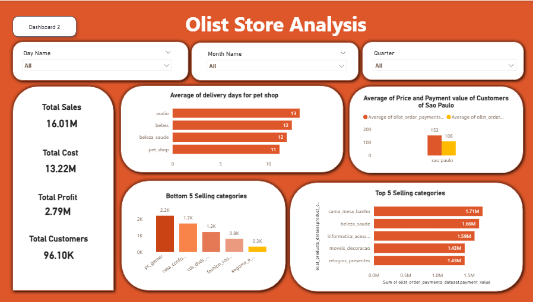
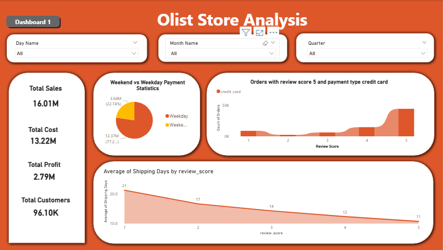

# Olist_Brazilian_Ecommerce_Powerbi_Dashboard

## 📁 Download PBIX File
**Note:** File size >25MB hone ki wajah se Google Drive link diya hai 👇

[📊 Click here to download Olist_Store_Analysis.pbix][(https://drive.google.com/file/d/1-0G39pWZARzvd_-qA0LwQ54LnMBU5Pkw/view?usp=drive_link))

> Dashboard screenshots repo me available hain. Full interactive dashboard ke liye PBIX download karein.

---

## 🚀 Project Overview
End-to-end Power BI dashboard analyzing 100k+ Olist orders. 5 KPIs, Category insights & delivery impact analysis.

## 📊 Key Highlights
- **Records Analyzed:** 1,00,000+ orders
- **Dashboards:** 2 Interactive Pages  
- **KPIs Tracked:** Revenue, Orders, Delivery Time, Top Categories
- **Tools:** Power BI, DAX, Power Query, Data Modeling

## 📸 Dashboard Preview

## 🛠️ Skills Demonstrated
Data Cleaning | DAX Measures | KPI Design | Data Storytelling | Business Insights
